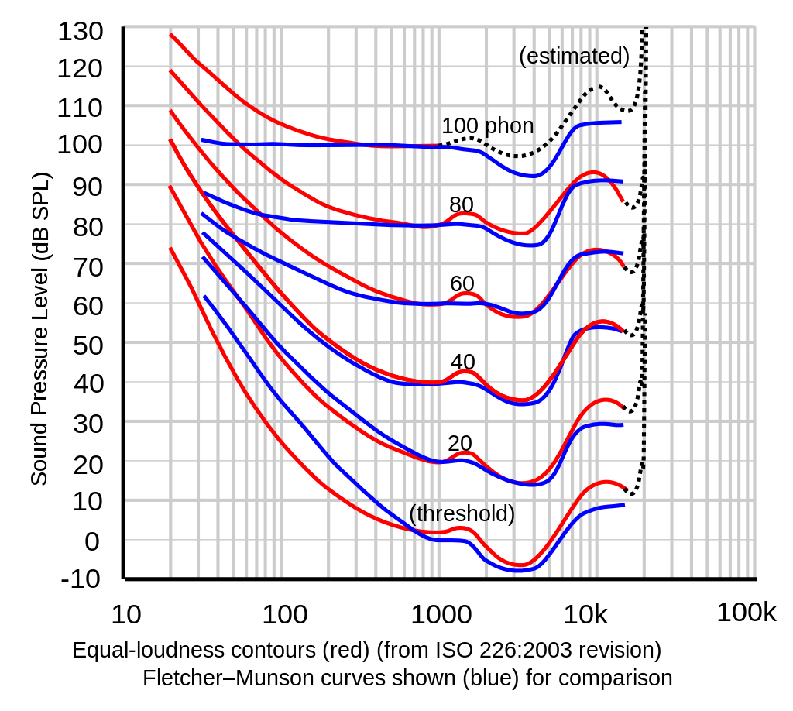
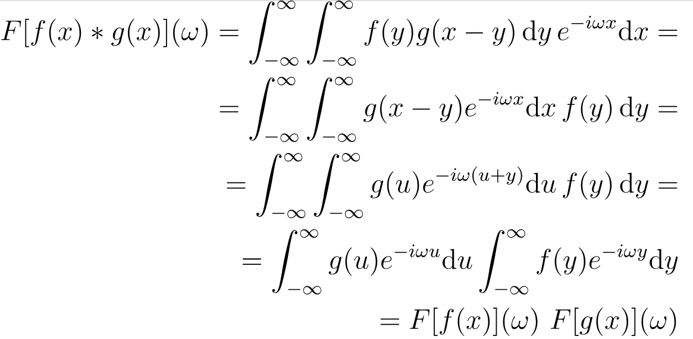

# Isosonic Compensation

A dynamic audio compensation of the isosonic curves


## Introduction

This is my bachelor's degree final project.

Most audio materials are edited, mixed and eventually mastered by a sound engineer at a standard level of approximately 80dB SPL (typically at 1 meter). This level is high enough to allow the sound engineer to perceive the whole dynamic range and details of the audio material while remaining low enough to prevent any hearing damages. Of all the possible ways a sound engineer could shape the sound, balancing the frequency spectrum correctly is of great importance, and a difference of 3dB on a particular frequency band might greatly influence the result. 

Final audio materials are played at different levels depending on the context. In a night club, it might be 110dB SPL. Using headphones, probably 70dB SPL. At home or at the office as an audio background however, it will range from 20db SPL to 60db SPL. We know that the human ear does not have a flat spectral sensitivity. We usually approximate our sensitivity to relative intensities and frequencies as logarithmic, but it is more complex than that. Equal-loudness contour curves were created to characterize precisely the human ear sensitivity to relative frequencies. The most famous is the [Fletcher-Munson](https://en.wikipedia.org/wiki/Equal-loudness_contour) set of curves determined experimentally by Harvey Fletcher and Wilden A. Munson in 1933.

<p style="width:300px; margin: auto;" >
  
</p>

Final audio materials are played at different levels depending on the context. In a night club, it might be 110dB SPL. Using headphones, probably 70dB SPL. At home or at work as an audio background however, it will range from 20db SPL to 60db SPL. We know that humans do not have a flat spectral sensitivity of frequency against amplitude. We usually approximate our sensitivity to relative intensities and frequencies as logarithmic, but it is more complex than that. Equal-loudness contour curves were created to characterize precisely the human ear sensitivity to relative frequencies. The most famous one is the [Fletcher-Munson](https://en.wikipedia.org/wiki/Equal-loudness_contour) set of curves determined experimentally by Harvey Fletcher and Wilden A. Munson in 1933.


## How do I use it ?

You first need to install the development libraries of FFTW3 on your machine. On Debian 10, that would be

```
sudo apt install libfftw3-dev
```

then compile by running

```
make
```

This produces an executable named `./isosonic_compensation` that should be used as follow

```
./isosonic_compensation [input_file] [output_file] [window_size] [listening_level]
```

The different transfer functions can be plotted in folder `/curve` by running

```
./gnuplot.sh
```

`window_size` should be a power of two in the range [8-2^16] and `listening_level` in dbSPL must be in the range [40-80]. A buffer size of size 4096 is recommended. The program currently supports 16bits PCM .wav file with any sample rate.


## How it works

Using a fast Fourier transform (FFTW library) and an appropriate sliding window, we take the product of the audio file's spectrum with an appropriate transfer function. This is known to be much faster than convoluting the signal with the impulse response.

<p style="width:400px; margin: auto;" >
  
</p>


## Program Flow

- input parameters
- process curves if needed
- craft transfer function
- .wav header read/write
- buffer loop
  - buffer read
    - circshift
    - fft r2c
    - complex product with transfer function
    - ifft c2r
    - circshift
  - data write
- update header of output .wav
- free memory


## Possible improvements

- Apply Hann windows to remove the windowing artifacts (regular click) and reduce distortion.
- Normalize the output to -3dB FS max.
- Improve the quality of the transfer function set.
- Improve the execution speed by getting rid of fseek() statements.